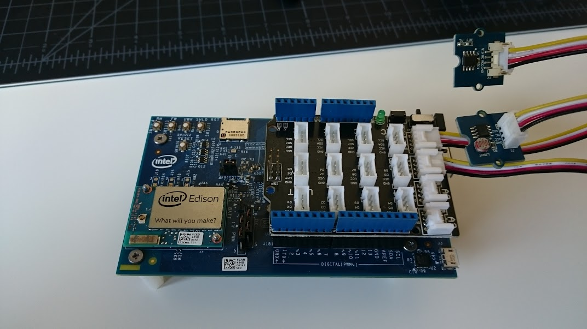

###Running the Node.js Sample app 

This Node.js AWS IoT sample app is used to read a pair of sensors plugged into the Intel Edison and send the data up to the AWS IoT cloud service.

In order to run it you must first complete the setup outlined at https://github.com/intel-iot-devkit/aws-iot-intel/blob/master/README.md in order to generate the certificates needed to connect to the service.

You will also need the Javascript SDK which can be found here: https://github.com/aws/aws-iot-thing-sdk-js

If you have not done so pull the rootCA to your cert directory with: 

```
curl https://www.symantec.com/content/en/us/enterprise/verisign/roots/VeriSign-Class%203-Public-Primary-Certification-Authority-G5.pem > ~/aws_certs/rootCA.pem 
```

Once you have completed the initial setup connect a Grove shield sensor to the Intel Edison. Connect a Grove light sensor into A0 and a Grove temperature sensor into A1 as shown below:



###Install dependencies 

Install the following modules:

```
npm install -g inherits
npm install -g mqtt
npm install -g minimist
```


- Copy the sample code, along with all the folder contents, over to the Intel Edison using a FTP client such as FileZilla. Make sure that the device, common, and thing directories are in the same folder as the sample app when you run it.  

- On line 26 you can change the name of your device, the default is "EdisonGroveSensors" 

- On lines 31-36 you can edit the certificate details. If you followed the steps outlined in the above tutorial the defualt paths should be correct. 

-Run the sample with:

```
node Edison-JS-Sample.js
```
